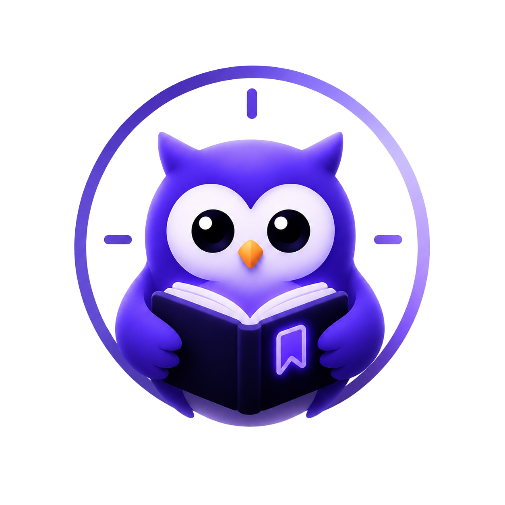

<div align="center">



# StudyTracker

### AI-Assisted Study Management App for Competitive Exam Preparation

[](https://reactnative.dev)
[](https://expo.dev)
[](https://github.com/pmndrs/zustand)
[](https://react-native-async-storage.github.io/async-storage/)
[](https://katex.org)
[](LICENSE)

**One app for syllabus tracking, study sessions, rich notes, and an AI assistant that actually knows what you've studied.**

[Features](#-features) • [Demo & Screenshots](#-demo--screenshots) • [Architecture](#-architecture) • [Tech Stack](#-tech-stack) • [Setup Guide](#%EF%B8%8F-setup-guide) • [Engineering Notes](#-engineering-challenges--solutions) • [Team](#-team)

</div>

---

## 📌 What is StudyTracker?

StudyTracker is a cross-platform mobile app built with **React Native (Expo)** for students preparing for competitive exams like **GATE CS** and **C-DAC C-CAT**. It replaces the usual scatter of separate apps — notes, timers, reminders, formula sheets, calculators, progress trackers — with a single, offline-first, distraction-free surface.

On top of the core tracker sits an AI layer that's actually wired into the app's live state rather than bolted on as a generic chatbot:

- **Pip**, an AI study assistant that reads real-time progress, goals, and study hours before answering.
- A **syllabus parser** that converts a pasted exam syllabus straight into structured goals, topics, and subtopics.
- A **quiz engine** that generates quizzes on any topic, stores every attempt, and lets you re-attempt to track improvement.

---

## ✨ Features

### 🧠 AI Layer
* **🦉 Pip — State-Aware Assistant** — Reads directly from the Zustand store (active goals, syllabus % complete, per-topic progress, hours studied today) so answers are grounded in your actual state, not a generic chat.
* **📋 Smart Syllabus Import** — Paste a raw exam syllabus and it's automatically parsed into subjects → topics → subtopics, fully editable afterward.
* **🧩 Quiz Engine** — Generates quizzes on demand for any subject or topic, renders them in a clean quiz UI, and stores full attempt history for review and re-attempts.

### 📚 Core Study Tools
* **🎯 Goal & Syllabus Management** — Multiple study goals with active-goal selection, subject-wise topic tracking, custom subjects/topics, and automatic activation of the next goal on completion.
* **⏱️ Study Session Tracker** — Absolute-timestamp stopwatch immune to backgrounding drift, full session history, and active-session recovery if the app closes mid-study.
* **📝 Rich Notes Module** — Bold, italics, headings, lists, code blocks, and embedded images via a custom rich-text toolbar. Paste notes straight from ChatGPT, Gemini, or Notion — markdown auto-converts to formatted rich text. Subject tagging, full-text search, and filtering included.
* **🧮 Productivity Toolkit** — Scientific calculator, reference formula sheets (OS, CN, DBMS, COA, Algorithms, Discrete Math), unit converter, and a reminder manager with local notifications.

---

## 🎬 Demo & Screenshots

| Screen | Key Functional Elements |
| --- | --- |
| **Dashboard** | Time-aware greeting, syllabus progress, active session flags, daily study stats. |
| **Pip (AI Assistant)** | Floating assistant surfaced across the app; answers grounded in live goal/syllabus/session state. |
| **Syllabus Planner** | Subject cards with progress meters, paste-to-import syllabus parsing, long-press goal linking. |
| **Rich Notebook** | WebView-based markdown + KaTeX editor with live formatting shortcuts. |
| **Quiz Arena** | On-demand quiz generation, attempt history, and re-attempt flow. |

*(Add screenshots to `assets/` and update the table above with image embeds when ready.)*

---

## 🏗 Architecture

### State-Centered Data Flow

```
┌──────────────────────────────────────────────────────────────┐
│                    UI LAYER (React Native Screens)            │
│                                                                │
│   Dashboard · Session Tracker · Syllabus Planner ·             │
│   Rich Notes · Quiz Arena                                     │
└────────────────────────────┬───────────────────────────────────┘
                             │ read / write
┌────────────────────────────▼───────────────────────────────────┐
│                        ZUSTAND STORE                           │
│   Single source of truth — goals, syllabus %, topic progress,  │
│   session hours, quiz history, background timers, modal state  │
└──────┬───────────────────────┬───────────────────────┬─────────┘
       │                       │                       │
┌──────▼────────┐   ┌──────────▼──────────┐   ┌─────────▼─────────┐
│ Pip — AI       │   │ Syllabus Parser     │   │ Quiz Engine        │
│ Assistant      │   │ pasted text →       │   │ AI-generated       │
│ (LLM-backed)   │   │ goals/topics/subs   │   │ quizzes + attempts │
└──────┬─────────┘   └──────────┬──────────┘   └─────────┬─────────┘
       │                       │                        │
┌──────▼───────────────────────▼────────────────────────▼─────────┐
│                    PERSISTENCE & COMPILER LAYER                  │
│   AsyncStorage (local DB)  ·  marked.js + WebView KaTeX compiler  │
│   ·  Native Modules (notifications, haptics, image picker)        │
└────────────────────────────────────────────────────────────────┘
```

---

## 🛠 Tech Stack

| Layer | Technology |
|-------|-----------|
| **Framework** | React Native, Expo |
| **Language** | JavaScript (ES6+) |
| **State Management** | Zustand (lightweight, decoupled reactive store) |
| **Persistence** | AsyncStorage — offline-first local database |
| **Rich Text Editor** | `react-native-pell-rich-editor` |
| **Markdown Engine** | `marked.js` (custom tokenizers) + KaTeX (WebView) |
| **Notifications** | `expo-notifications` |
| **Media** | `expo-image-picker` |
| **Layout & Input** | `react-native-safe-area-context`, `react-native-keyboard-aware-scroll-view` |
| **AI Layer** | LLM-backed assistant (Pip), syllabus parser, quiz generator |

---

## ⚙️ Setup Guide

### Prerequisites
* **Node.js**: Version 20+
* **Expo CLI**: `npm install -g expo-cli` (or use `npx expo`)
* **Expo Go app** (for quick device testing) or an Android/iOS simulator
* **AI Provider API Key**: required for Pip, syllabus parsing, and quiz generation

### 1. Clone & Install

```bash
git clone https://github.com/AradwadTushar/StudyTracker.git
cd StudyTracker
npm install
```

### 2. Environment Configuration

Create a `.env` file in the project root:

```env
EXPO_PUBLIC_AI_PROVIDER=gemini        # or your chosen LLM provider
EXPO_PUBLIC_AI_API_KEY=your_api_key_here
```

### 3. Run the App

```bash
npx expo start
```

Scan the QR code with the **Expo Go** app, or press `a` / `i` in the terminal to launch on an Android/iOS simulator.

### 4. Build for Distribution

```bash
eas build --platform android
eas build --platform ios
```

*(Requires an [EAS](https://docs.expo.dev/eas/) account and `eas.json` configuration.)*

---

## 🔧 Engineering Challenges & Solutions

A few non-trivial bugs came up during development — full write-ups are in the [case study](#):

1. **WebView Math Duplication** — KaTeX rendered duplicate DOM nodes (MathML + HTML span) inside the WebView editor, corrupting saved note previews. Fixed with a custom `cleanKaTeXHTML` sanitizer that extracts raw TeX from the `<annotation>` element before save.
2. **Markdown Tokenizer State Degradation** — A custom math extension for `marked.js` broke standard markdown formatting for all following text. Root cause: the extension's `start(src)` returned `-1` instead of `undefined`, corrupting the parser's scan cursor.
3. **Placeholder Key Collisions** — Sequential math placeholders (`TEMPPLACEHOLDER1`, `TEMPPLACEHOLDER10`, ...) collided during string replacement. Fixed by generating cryptographically random 8-character keys per placeholder.
4. **Floating Overlay / Keyboard Collisions** — Pip's floating mascot and the quick-tools FAB blocked the keyboard when editing notes. Fixed by binding modal visibility to the editor lifecycle and adding keyboard-focus listeners.

---

## 🔒 Data & Privacy

* **Offline-first** — core study data (sessions, syllabus, notes, goals) is stored locally via AsyncStorage; no account or server required for the base app.
* **AI calls only** — network requests are limited to the AI provider endpoint for Pip, syllabus parsing, and quiz generation. No study data is persisted server-side.
* **API keys** are read from environment variables and never hard-coded into the client bundle.

---

## 👥 Team

* **Tushar Aradwad** — *Developer*
  * [@AradwadTushar](https://github.com/AradwadTushar) | [LinkedIn](https://www.linkedin.com/in/tushar-aradwad-536570307)

---

## 📄 License

Shared open for development under the terms of the **MIT License**. Review the [LICENSE](/LICENSE) document for exact terms.
